# Динамическая оптимизация и оптимальное управление

**Задача 1**

Минимум функционала найденный численным методом составил -22704624.78974364

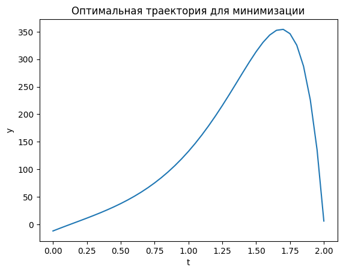

Убедимся, что верно нашли экстремаль, для этого попробуем максимизировать исходный функционал путём минимизации отрицательного значения заданной дискретной суммы.

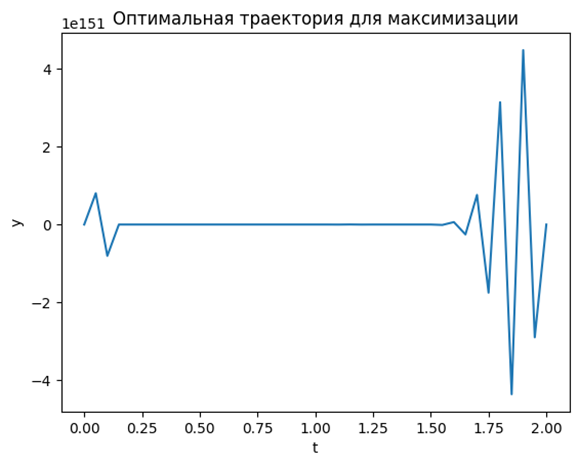

На графике видно, что не выполняются условия Коши исходной задачи, функция не гладкая, следовательно найденный нами минимум является единственным численным решением задачи поиска экстремума.

**Задача 2**

В результате поиска минимума функционала численным методом при помощи задачи оптимального управления, минимум не найден 

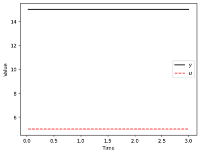
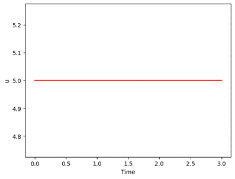

Теперь проверим для максимума:

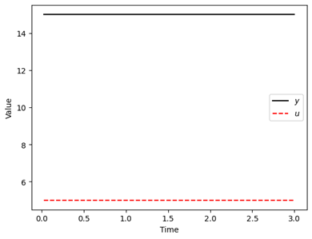

`Исходя из графиков можно сделать вывод, что в этой задаче нет экстремумов.`

**Задача 3**

Целевое значение функционала составило 98141.54

1.	Зададим формулы из условия в ячейки $M(t), M’(t), п(t), Tax (t), CF(t), NPV. R=0,3$

2.	Через поиск решения находим численным методом значения для столбца J(t)

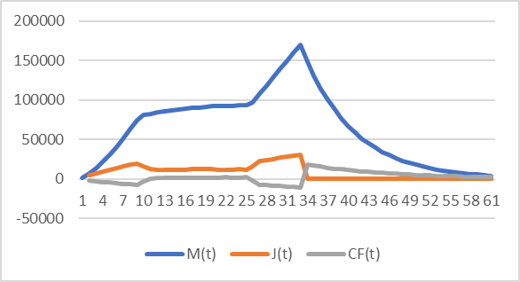

**Задача 3.1**

1.	В 1 пункте меняется значение $r$ для всех ячеек, начиная с $t=37$
Целевое значение функционала: 80298,92

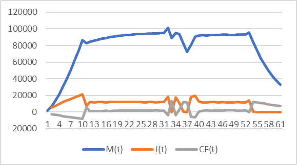

**Задача 3.2**

Во 2 пункте меняется значение для $Tax$ по формуле:

$$Tax(x) = \frac{1}{2(5 + c_2)}\pi(t)$$

Целевое значение функционала: 92240,48

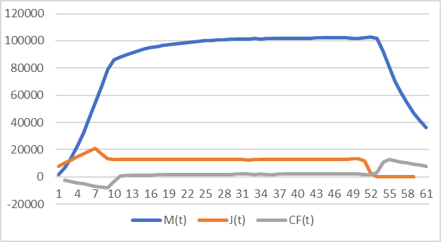

**Задача 3.3**

В 3 пункте меняется значение нормы амортизации

По формуле:

$$\delta = \frac{2}{5 + c_1}$$

Целевое значение функционала: 31576,89

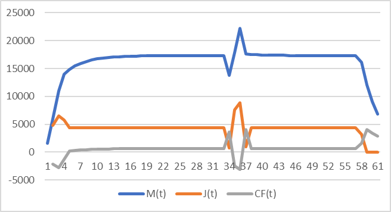

**Задача 6**

В качестве тестового начального условия возьмем $x_0 = 15$,  $v_0= 45$

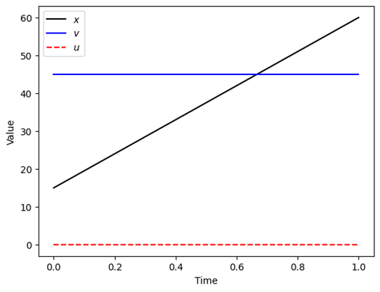

$x_0 = 88,  v_0= 94$

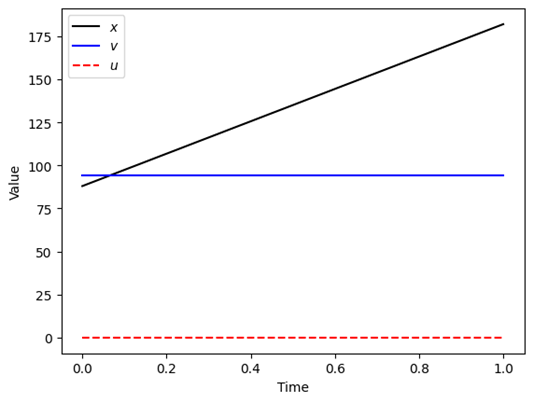

$x_0 = 92,  v_0= 55$

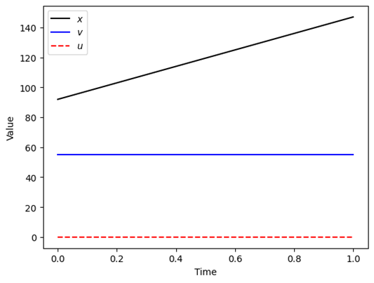

**Задача 7**

Численный экстремум функционала на заданном интервале для линейного разбиения: 

`[0.0, 3.082047634e-06, 1.4625727982e-05, 4.0351802228e-05, 8.6347776344e-05, 0.00015909568824, 0.00026550233278, 0.00041293216852, 0.00060924317747, 0.00086282598001, 0.0011826465422, 0.0015782928517, 0.002060025983, 0.0026388360237, 0.0033265033892, 0.0041356661188, 0.00507989382, 0.0061737690112, 0.0074329767068, 0.0088744032012, 0.010516245129, 0.01237813002, 0.014481249721, 0.01684850816, 0.019504174259, 0.022160422654, 0.024716672073, 0.027172921762, 0.029529171579, 0.031785421469, 0.033941671408, 0.035997921379, 0.037954171376, 0.039810421392, 0.041566671424, 0.043222921467, 0.044779171521, 0.046235421584, 0.047591671654, 0.048847921731, 0.050004171813, 0.0510604219, 0.052016671992, 0.052872922087, 0.053629172186, 0.054285422287, 0.054841672392, 0.055297922499, 0.055654172609, 0.055910422721, 0.056066672835, 0.05612292295, 0.056079173067, 0.055935423186, 0.055691673306, 0.055347923428, 0.054904173551, 0.054360423675, 0.0537166738, 0.052972923926, 0.052129174053, 0.051185424181, 0.05014167431, 0.04899792444, 0.04775417457, 0.046410424701, 0.044966674833, 0.043422924965, 0.041779175098, 0.040035425232, 0.038191675366, 0.0362479255, 0.034204175635, 0.032060425771, 0.029816675907, 0.027472926043, 0.025029176179, 0.022485426316, 0.019841676454, 0.017097926591, 0.014254176729, 0.011310426868, 0.008266677006, 0.0051229271447, 0.0018791772836, -0.0014645725773, -0.0049083224379, -0.0084520722985, -0.012095822159, -0.015839572019, -0.019683321879, -0.023627071739, -0.027670821599, -0.031814571459, -0.036058321318, -0.040402071178, -0.044845821037, -0.049389570897, -0.054033320756, -0.058777070616, -0.063620820475, -0.068564570334, -0.073608320194, -0.078752070053, -0.083995819913, -0.089339569772, -0.094783319632, -0.10032706949, -0.10597081935, -0.11171456921, -0.11755831907, -0.12350206893, -0.12954581879, -0.13568956865, -0.14193331851, -0.14827706837, -0.15472081823, -0.16126456809, -0.16790831796, -0.17465206782, -0.18149581768, -0.18843956754, -0.1954833174, -0.20262706727, -0.20987081713, -0.21721456699, -0.22465831686, -0.23220206672, -0.23984581659, -0.24758956645, -0.25543331632, -0.26337706618, -0.27142081605, -0.27956456592, -0.28780831578, -0.29615206565, -0.30459581552, -0.31313956539, -0.32178331526, -0.33052706513, -0.339370815, -0.34831456488, -0.35735831475, -0.36650206462, -0.3757458145, -0.38508956438, -0.39453331426, -0.40407706414, -0.41372081402, -0.4234645639, -0.43330831378, -0.44325206367, -0.45329581356, -0.46343956345, -0.47368331334, -0.48402706324, -0.49447081314, -0.50501456304, -0.51565831294, -0.52640206285, -0.53724581276, -0.54818956268, -0.5592333126, -0.57037706253, -0.58162081247, -0.59296456242, -0.60440831237, -0.61595206234, -0.62759581233, -0.63933956233, -0.65118331236, -0.66312706242, -0.67517081253, -0.68731456271, -0.69955831302, -0.7119020636, -0.72434581529, -0.7369904181, -0.75012315966, -0.76372003996, -0.77775815507, -0.79221631314, -0.80707488665, -0.82231567895, -0.83792180376, -0.85387757606, -0.87016841333, -0.88678074596, -0.90370193592, -0.92092020279, -0.93842455648, -0.95620473592, -0.97425115312, -0.99255484211, -1.0111074123, -1.0299010056, -1.0489282577, -1.0681822617, -1.0876565357, -1.107344992, -1.1272419099]`

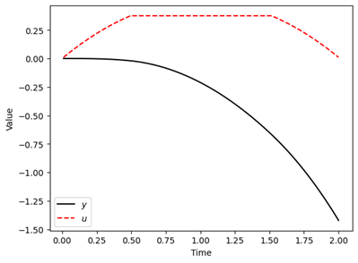
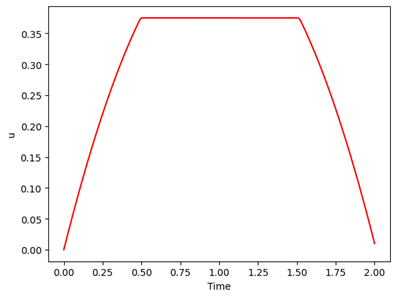

**(b)**
Численный экстремум функционала на заданном интервале для линейного разбиения: `[0.0, 3.082047634e-06, 1.4625727982e-05, 4.0351802228e-05, 8.6347776344e-05, 0.00015909568824, 0.00026550233278, 0.00041293216852, 0.00060924317747, 0.00086282598001, 0.0011826465422, 0.0015782928517, 0.002060025983, 0.0026388360237, 0.0033265033892, 0.0041356661188, 0.00507989382, 0.0061737690112, 0.0074329767068, 0.0088744032012, 0.010516245129, 0.01237813002, 0.014481249721, 0.01684850816, 0.019504174259, 0.022160422654, 0.024716672073, 0.027172921762, 0.029529171579, 0.031785421469, 0.033941671408, 0.035997921379, 0.037954171376, 0.039810421392, 0.041566671424, 0.043222921467, 0.044779171521, 0.046235421584, 0.047591671654, 0.048847921731, 0.050004171813, 0.0510604219, 0.052016671992, 0.052872922087, 0.053629172186, 0.054285422287, 0.054841672392, 0.055297922499, 0.055654172609, 0.055910422721, 0.056066672835, 0.05612292295, 0.056079173067, 0.055935423186, 0.055691673306, 0.055347923428, 0.054904173551, 0.054360423675, 0.0537166738, 0.052972923926, 0.052129174053, 0.051185424181, 0.05014167431, 0.04899792444, 0.04775417457, 0.046410424701, 0.044966674833, 0.043422924965, 0.041779175098, 0.040035425232, 0.038191675366, 0.0362479255, 0.034204175635, 0.032060425771, 0.029816675907, 0.027472926043, 0.025029176179, 0.022485426316, 0.019841676454, 0.017097926591, 0.014254176729, 0.011310426868, 0.008266677006, 0.0051229271447, 0.0018791772836, -0.0014645725773, -0.0049083224379, -0.0084520722985, -0.012095822159, -0.015839572019, -0.019683321879, -0.023627071739, -0.027670821599, -0.031814571459, -0.036058321318, -0.040402071178, -0.044845821037, -0.049389570897, -0.054033320756, -0.058777070616, -0.063620820475, -0.068564570334, -0.073608320194, -0.078752070053, -0.083995819913, -0.089339569772, -0.094783319632, -0.10032706949, -0.10597081935, -0.11171456921, -0.11755831907, -0.12350206893, -0.12954581879, -0.13568956865, -0.14193331851, -0.14827706837, -0.15472081823, -0.16126456809, -0.16790831796, -0.17465206782, -0.18149581768, -0.18843956754, -0.1954833174, -0.20262706727, -0.20987081713, -0.21721456699, -0.22465831686, -0.23220206672, -0.23984581659, -0.24758956645, -0.25543331632, -0.26337706618, -0.27142081605, -0.27956456592, -0.28780831578, -0.29615206565, -0.30459581552, -0.31313956539, -0.32178331526, -0.33052706513, -0.339370815, -0.34831456488, -0.35735831475, -0.36650206462, -0.3757458145, -0.38508956438, -0.39453331426, -0.40407706414, -0.41372081402, -0.4234645639, -0.43330831378, -0.44325206367, -0.45329581356, -0.46343956345, -0.47368331334, -0.48402706324, -0.49447081314, -0.50501456304, -0.51565831294, -0.52640206285, -0.53724581276, -0.54818956268, -0.5592333126, -0.57037706253, -0.58162081247, -0.59296456242, -0.60440831237, -0.61595206234, -0.62759581233, -0.63933956233, -0.65118331236, -0.66312706242, -0.67517081253, -0.68731456271, -0.69955831302, -0.7119020636, -0.72434581529, -0.7369904181, -0.75012315966, -0.76372003996, -0.77775815507, -0.79221631314, -0.80707488665, -0.82231567895, -0.83792180376, -0.85387757606, -0.87016841333, -0.88678074596, -0.90370193592, -0.92092020279, -0.93842455648, -0.95620473592, -0.97425115312, -0.99255484211, -1.0111074123, -1.0299010056, -1.0489282577, -1.0681822617, -1.0876565357, -1.107344992, -1.1272419099]`

**Задача 8**

Найденное alpha: 5.0

Найденное beta: 0.0

Найденное gamma: 2.0

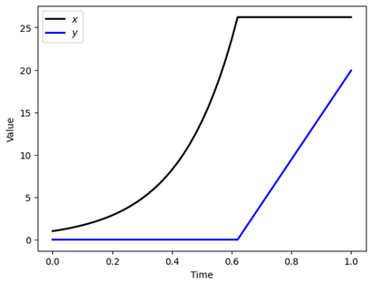
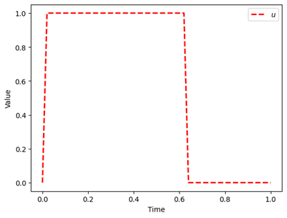

Найденное alpha: 10.0

Найденное beta: 0.0

Найденное gamma: 10.0

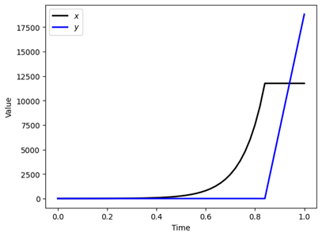
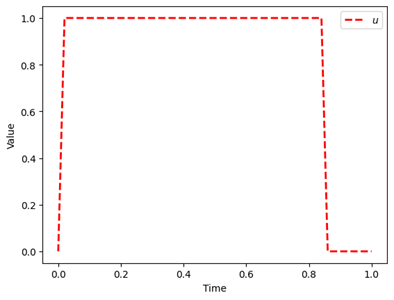

Найденное alpha: 8.0

Найденное beta: 0.0

Найденное gamma: 5.0

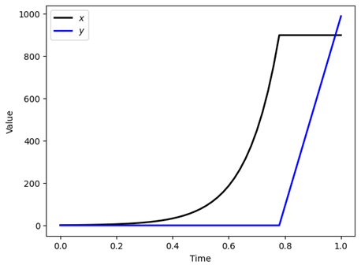
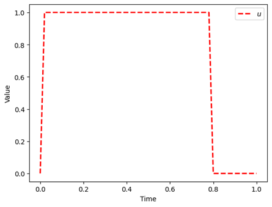

Найденное alpha: 8.0

Найденное beta: 0.0

Найденное gamma: 6.0

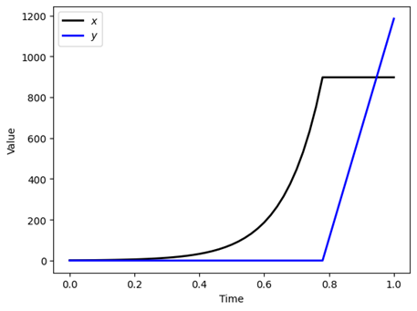
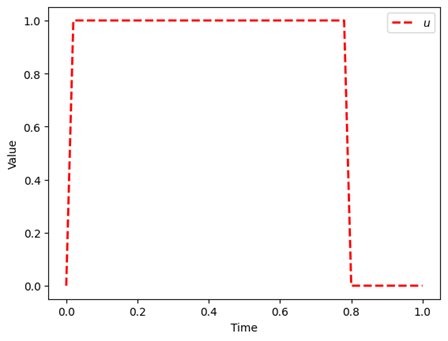

Изменения в параметрах $\alpha, \beta$ и $\gamma$ влияют на конечное состояние улья, но не сильно меняют траекторию его развития во времени. При максимизации числа королев в конечный момент времени управление $u(t)$ будет подстраиваться таким образом, чтобы оптимизировать это число, и, следовательно, количество ос-рабочих и королев к концу времени.